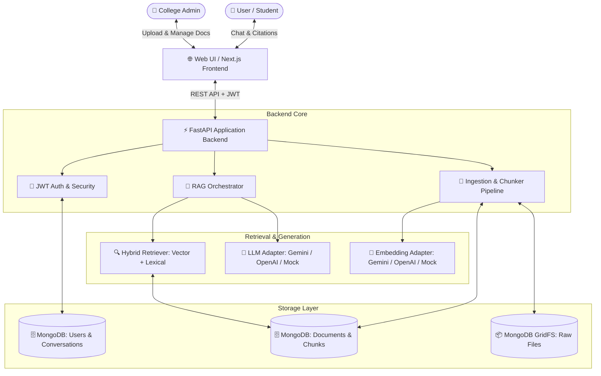

# 🏛️ College RAG AI Assistant — Complete Setup & Local Development Guide

A cloud-native, enterprise-grade AI information assistant powered by **Retrieval-Augmented Generation (RAG)** and backed by **MongoDB**. 

The assistant retrieves verified facts from approved college documents (admissions, fees, exams, hostel, academic calendar) and produces grounded answers with exact source citations while refusing out-of-domain or unanswerable questions without hallucination.

---

## 📋 Table of Contents
1. [🌟 Features & Capabilities](#-features--capabilities)
2. [📐 System Architecture](#-system-architecture)
3. [💻 Prerequisites](#-prerequisites)
4. [🚀 Step-by-Step Local Setup Guide](#-step-by-step-local-setup-guide)
   - [Step 1: Clone & Open the Project](#step-1-clone--open-the-project)
   - [Step 2: Create & Activate a Python Virtual Environment](#step-2-create--activate-a-python-virtual-environment)
   - [Step 3: Install Python Dependencies](#step-3-install-python-dependencies)
   - [Step 4: Configure Environment Variables (`.env`)](#step-4-configure-environment-variables-env)
   - [Step 5: Initialize & Seed the Database](#step-5-initialize--seed-the-database)
   - [Step 6: Start the Application Server](#step-6-start-the-application-server)
   - [Step 7: Access the Web UI & API Docs](#step-7-access-the-web-ui--api-docs)
5. [🖥️ Alternative Running Methods](#-alternative-running-methods)
   - [Option A: Next.js Frontend Development Mode](#option-a-nextjs-frontend-development-mode-optional)
   - [Option B: Docker Compose Setup](#option-b-docker-compose-setup-optional)
6. [📖 How to Use the Application](#-how-to-use-the-application)
   - [Default Accounts & Roles](#default-accounts--roles)
   - [User Authentication](#1-user-authentication)
   - [Asking Questions & Source Citations](#2-asking-questions--source-citations)
   - [Admin Document Management Portal](#3-admin-document-management-portal)
7. [🧪 Running Tests & RAG Evaluation Benchmark](#-running-tests--rag-evaluation-benchmark)
8. [🔌 REST API Reference](#-rest-api-reference)
9. [☁️ Supported AI & Storage Providers](#-supported-ai--storage-providers)
10. [📂 Project Directory Structure](#-project-directory-structure)
11. [❓ Troubleshooting & FAQs](#-troubleshooting--faqs)

---

## 🌟 Features & Capabilities

- 🔍 **Hybrid Search Retrieval**: Combines semantic dense vector embeddings with lexical keyword matching (BM25) for high-precision fact retrieval.
- 📌 **Exact Source Citations**: Every answer includes document titles, versions, sections, page numbers, and verbatim evidence snippets.
- 🛡️ **Zero-Hallucination Refusal**: Safely rejects out-of-scope or ungrounded questions with transparent notices instead of guessing.
- 🔐 **Role-Based Access Control (RBAC)**: JWT authentication with dedicated `admin` and `student` permissions.
- 📁 **Admin Ingestion Pipeline**: In-memory parsing for PDF, DOCX, TXT, MD, automated text chunking, embedding generation, and MongoDB GridFS file storage.
- 🔄 **Document Lifecycle Management**: Instant publish, unpublish, archive, and one-click re-indexing of documents.
- 📊 **Audit Logs & Analytics**: Built-in monitoring for query volumes, citation rates, unanswered query frequency, and administrative actions.
- ⚡ **Offline Mock Mode**: Fully testable offline without any paid API keys using deterministic TF-IDF embeddings and synthesizer.

---

## 📐 System Architecture



---

## 💻 Prerequisites

Ensure you have the following installed on your machine before setup:

1. **Python 3.10, 3.11, or 3.12**
   - Check version:
     ```bash
     python --version
     # or on macOS/Linux:
     python3 --version
     ```
2. **A MongoDB Connection (Choose one)**:
   - **MongoDB Atlas (Recommended — Free Cloud)**: Create a free M0 cluster at [mongodb.com/atlas](https://www.mongodb.com/atlas).
   - **Local MongoDB Community Server**: Running locally on `mongodb://localhost:27017`.
3. *(Optional)* **Node.js 18+ & npm** (Only if you wish to run the standalone Next.js frontend dev server).
4. *(Optional)* **Docker & Docker Compose** (Only if you wish to run containerized services).
5. *(Optional)* **Google Gemini or OpenAI API Key** (Or run completely free in `mock` mode).

---

## 🚀 Step-by-Step Local Setup Guide

### Step 1: Clone & Open the Project

Open your terminal (PowerShell, Command Prompt, or Bash) and navigate to the project root directory:
```bash
cd "c:\Projects\Rag AI Chatbot"
```

---

### Step 2: Create & Activate a Python Virtual Environment

It is strongly recommended to use a virtual environment to isolate dependencies.

#### On Windows (PowerShell):
```powershell
# Create virtual environment
python -m venv venv

# If you receive an execution policy error in PowerShell, run:
Set-ExecutionPolicy -Scope Process -ExecutionPolicy Bypass

# Activate virtual environment
.\venv\Scripts\Activate.ps1
```

#### On Windows (Command Prompt `cmd.exe`):
```cmd
python -m venv venv
.\venv\Scripts\activate.bat
```

#### On macOS / Linux:
```bash
python3 -m venv venv
source venv/bin/activate
```

*(You will see `(venv)` appear at the beginning of your command prompt line when activated.)*

---

### Step 3: Install Python Dependencies

With your virtual environment active, upgrade `pip` and install the required packages:

```bash
python -m pip install --upgrade pip
pip install -r backend/requirements.txt
```

---

### Step 4: Configure Environment Variables (`.env`)

1. Copy the example environment configuration file to create your active `.env` file:

   **On Windows (PowerShell):**
   ```powershell
   Copy-Item .env.example .env
   ```

   **On Windows (CMD) / Linux / macOS:**
   ```bash
   cp .env.example .env
   ```

2. Open **[`.env`](file:///c:/Projects/Rag%20AI%20Chatbot/.env)** in your editor and configure your database and AI provider settings:

```env
# ==============================================================================
# 1. MongoDB Database Configuration (Required)
# ==============================================================================
DATABASE_TYPE="mongodb"
STORAGE_TYPE="mongodb"

# Enter your MongoDB connection URI (Atlas or Local):
MONGODB_URI="mongodb+srv://<username>:<password>@cluster0.mongodb.net/?retryWrites=true&w=majority"
MONGODB_DB_NAME="college_rag"

# ==============================================================================
# 2. AI Provider Configuration (Choose Option A, B, or C)
# ==============================================================================

# OPTION A: Google Gemini (Recommended - Free Tier Available)
LLM_PROVIDER="gemini"
LLM_API_KEY="AIzaSyYourGeminiApiKeyHere"
LLM_MODEL="gemini-1.5-flash"
EMBEDDING_PROVIDER="gemini"
EMBEDDING_API_KEY="AIzaSyYourGeminiApiKeyHere"
EMBEDDING_MODEL="models/text-embedding-004"

# OPTION B: OpenAI
# LLM_PROVIDER="openai"
# LLM_API_KEY="sk-your-openai-api-key-here"
# LLM_MODEL="gpt-4o-mini"
# EMBEDDING_PROVIDER="openai"
# EMBEDDING_API_KEY="sk-your-openai-api-key-here"
# EMBEDDING_MODEL="text-embedding-3-small"

# OPTION C: Mock Mode (100% Free, Offline, Zero API Keys Required)
# LLM_PROVIDER="mock"
# EMBEDDING_PROVIDER="mock"

# ==============================================================================
# 3. Security Settings
# ==============================================================================
AUTH_SECRET="your_custom_jwt_secret_key_change_me_12345"
ACCESS_TOKEN_EXPIRE_MINUTES=10080
```

> [!TIP]
> **MongoDB Atlas Quick Setup:**
> 1. Go to [MongoDB Atlas](https://www.mongodb.com/atlas) and create a free Shared M0 cluster.
> 2. Under **Security > Database Access**, add a database user with a username and password.
> 3. Under **Security > Network Access**, click **Add IP Address** and select **Allow Access from Anywhere (`0.0.0.0/0`)**.
> 4. Under **Deployment > Database**, click **Connect > Drivers > Python** and copy the connection string into `MONGODB_URI`.

---

### Step 5: Initialize & Seed the Database

Run the automated initialization and seeding script:

```bash
python scripts/seed_data.py
```

#### What this script does automatically:
1. **Creates MongoDB Collections & Indexes**: Establishes unique indexes for users, conversations, documents, and vector chunk lookups.
2. **Creates Default System Users**:
   - 👑 **Admin User**: `admin@college.edu` (Password: `admin123`)
   - 🎓 **Student User**: `student@college.edu` (Password: `student123`)
3. **Ingests & Vectorizes 5 Official College Handbooks**:
   - `admissions_policy_2026.txt` (Eligibility, cutoff ranks, deadlines, seat reservation)
   - `cse_fee_structure_2026.txt` (Tuition, hostel, bus fees, scholarship criteria)
   - `hostel_handbook_2026.txt` (Room allocation, curfew rules, mess timings)
   - `exam_regulations_2026.txt` (75% attendance policy, grading scale, backlogs)
   - `academic_calendar_2026_27.txt` (Semester dates, internal assessments, holidays)
4. **Embeds and Publishes Documents**: Parses text, generates chunk embeddings, saves raw files to GridFS, and marks them as **Published** for immediate querying.

---

### Step 6: Start the Application Server

Start the unified FastAPI application server (which simultaneously serves the API backend and the embedded frontend UI):

```bash
python scripts/run_dev.py
```

*Alternative direct uvicorn command:*
```bash
uvicorn backend.app.main:app --host 0.0.0.0 --port 8000 --reload
```

Upon starting, your terminal will display:
```
Starting College RAG Assistant server on http://localhost:8000 ...
Swagger API documentation available at: http://localhost:8000/docs
Frontend UI available at: http://localhost:8000/
INFO:     Uvicorn running on http://0.0.0.0:8000 (Press CTRL+C to quit)
```

---

### Step 7: Access the Web UI & API Docs

Open your browser and navigate to:

| Service / Interface | Local URL | Description |
| :--- | :--- | :--- |
| 🌐 **Web Chatbot & Admin UI** | [**http://localhost:8000/**](http://localhost:8000/) | Main user chat interface and admin management portal |
| 📖 **Interactive API Docs (Swagger)** | [**http://localhost:8000/docs**](http://localhost:8000/docs) | Test and explore all REST endpoints with live schema |
| 📚 **ReDoc Documentation** | [**http://localhost:8000/redoc**](http://localhost:8000/redoc) | Clean, readable OpenAPI documentation |
| 🩺 **System Health Check** | [**http://localhost:8000/api/health**](http://localhost:8000/api/health) | Real-time database and service status |

---

## 🖥️ Alternative Running Methods

### Option A: Next.js Frontend Development Mode (Optional)

If you are developing or modifying the Next.js React frontend source code:

1. Open a new terminal in the `frontend` directory:
   ```bash
   cd frontend
   ```
2. Install Node.js dependencies:
   ```bash
   npm install
   ```
3. Start the Next.js development server:
   ```bash
   npm run dev
   ```
4. Access the React frontend at [**http://localhost:3000/**](http://localhost:3000/).

---

### Option B: Docker Compose Setup (Optional)

If you prefer running a fully containerized stack with local PostgreSQL / pgvector and Redis:

```bash
docker-compose -f infra/docker-compose.yml up --build
```

To stop containers:
```bash
docker-compose -f infra/docker-compose.yml down
```

---

## 📖 How to Use the Application

### Default Accounts & Roles

| Role | Email | Password | Access Rights |
| :--- | :--- | :--- | :--- |
| **Admin** | `admin@college.edu` | `admin123` | Chat, Upload Documents, Publish/Archive, View Audit Logs, Metrics |
| **Student** | `student@college.edu` | `student123` | Chat, View Conversations, Submit Question Feedback |

---

### 1. User Authentication
1. Open [http://localhost:8000/](http://localhost:8000/).
2. Log in using the **Sign In** tab with either the default student or admin credentials.
3. Or switch to the **Register** tab to create a new user account with your name, email, department, and password.

---

### 2. Asking Questions & Source Citations
1. Select or create a conversation from the sidebar.
2. Ask any college-related question, for example:
   - *"What is the annual tuition fee for CSE first year?"*
   - *"What are the curfew hours and mess timings for the hostel?"*
   - *"What is the minimum attendance percentage required to sit for semester exams?"*
   - *"What is the last date to submit the admission application form?"*
3. **Inspect Citations**: Click on any citation badge under the answer to view the source document title, version, page, and exact matching context.
4. **Test Refusal Guardrails**: Try asking an unanswerable query (e.g. *"What will the weather be tomorrow?"* or *"Who won the cricket match?"*). The system will safely refuse without making up false details.
5. **Feedback**: Click 👍 or 👎 under any answer to record user ratings.

---

### 3. Admin Document Management Portal
1. Sign in with the Admin account (`admin@college.edu` / `admin123`).
2. Click the **⚙️ Admin** button in the top navigation bar or sidebar.
3. **Upload New Documents**:
   - Click **"+ Upload New Document"**.
   - Enter a title, select a department/collection, and choose a `.pdf`, `.docx`, `.txt`, or `.md` file.
   - Click **"Upload & Ingest"**. The file is uploaded to MongoDB GridFS, parsed, chunked, and embedded.
4. **Publish / Archive**:
   - Click **"Publish"** to make a document live and searchable.
   - Click **"Archive"** to immediately retire a document from query retrieval.
5. **View System Analytics**:
   - Monitor total indexed documents, total chunks, query volume, citation accuracy, and real-time audit logs.

---

## 🧪 Running Tests & RAG Evaluation Benchmark

### 1. Run Automated Unit & Integration Tests
```bash
pytest backend/tests -v
```

### 2. Run the 50-Query RAG Evaluation Benchmark
The repository includes a comprehensive evaluation dataset ([`evaluation/dataset.json`](file:///c:/Projects/Rag%20AI%20Chatbot/evaluation/dataset.json)) measuring retrieval precision, groundedness, recall@k, and unknown-refusal accuracy:

```bash
python evaluation/evaluate_rag.py
```

**Expected benchmark output metrics:**
- **Recall@k (Target Doc Hit Rate)**: `≥ 95%`
- **Groundedness Accuracy**: `≥ 90%`
- **Unknown-Refusal Accuracy**: `100%`
- **Average Retrieval Latency**: `< 50ms`

---

## 🔌 REST API Reference

All backend endpoints are prefixed under `/api`:

| Method | Endpoint | Description | Auth Required |
| :--- | :--- | :--- | :--- |
| `POST` | `/api/auth/register` | Register a new user | No |
| `POST` | `/api/auth/login` | Authenticate and obtain JWT access token | No |
| `GET` | `/api/auth/me` | Get current authenticated user profile | Yes (User/Admin) |
| `GET` | `/api/chat/conversations` | List user's conversations | Yes (User/Admin) |
| `POST` | `/api/chat/conversations` | Create a new chat conversation | Yes (User/Admin) |
| `POST` | `/api/chat/conversations/{id}/messages` | Send question and execute RAG query | Yes (User/Admin) |
| `POST` | `/api/chat/messages/{id}/feedback` | Submit thumbs up/down rating | Yes (User/Admin) |
| `GET` | `/api/admin/documents` | List all documents and statuses | Yes (Admin) |
| `POST` | `/api/admin/documents/upload` | Upload & ingest document (PDF/DOCX/TXT) | Yes (Admin) |
| `POST` | `/api/admin/documents/{id}/publish` | Publish document to knowledge base | Yes (Admin) |
| `POST` | `/api/admin/documents/{id}/archive` | Archive document | Yes (Admin) |
| `POST` | `/api/admin/documents/{id}/reindex` | Re-chunk and re-embed document | Yes (Admin) |
| `GET` | `/api/admin/metrics` | Retrieve usage metrics & citation rates | Yes (Admin) |
| `GET` | `/api/admin/logs` | Fetch system audit logs | Yes (Admin) |
| `GET` | `/api/health` | Health check & database connection probe | No |

---

## ☁️ Supported AI & Storage Providers

| Component | Providers Supported | Configuration Field in `.env` |
| :--- | :--- | :--- |
| **Database & File Storage** | MongoDB Atlas, Local MongoDB, GridFS | `MONGODB_URI`, `MONGODB_DB_NAME` |
| **LLM Generation** | Google Gemini (`gemini-1.5-flash`), OpenAI (`gpt-4o-mini`), Mock Generator | `LLM_PROVIDER`, `LLM_API_KEY`, `LLM_MODEL` |
| **Vector Embeddings** | Google Gemini (`text-embedding-004`), OpenAI (`text-embedding-3-small`), Mock | `EMBEDDING_PROVIDER`, `EMBEDDING_API_KEY`, `EMBEDDING_MODEL` |

---

## 📂 Project Directory Structure

```
c:\Projects\Rag AI Chatbot/
├── backend/
│   ├── app/
│   │   ├── api/v1/          # REST API endpoints (auth, chat, admin, health)
│   │   ├── auth/            # JWT authentication & password hashing (bcrypt)
│   │   ├── core/            # Config, database connection, errors, logging
│   │   ├── documents/       # In-memory PDF, DOCX, TXT, MD parsers
│   │   ├── integrations/    # LLM, Embedding, and MongoDB GridFS adapters
│   │   ├── models/          # MongoDB Pydantic document schemas
│   │   ├── rag/             # Chunker, retriever, reranker, prompts, orchestrator
│   │   ├── workers/         # Background document ingestion pipeline
│   │   └── main.py          # FastAPI application & static frontend mount
│   ├── tests/               # Automated test suite
│   └── requirements.txt     # Python package dependencies
├── frontend/
│   ├── static/              # Interactive Web Chat & Admin Portal (HTML, CSS, JS)
│   ├── app/                 # Next.js 14 React application source
│   ├── package.json         # Node package configuration
│   └── tailwind.config.js   # Tailwind CSS styling configuration
├── sample_data/             # 5 Official college sample documents for seeding
├── evaluation/              # 50-query RAG benchmark suite & evaluate_rag.py
├── scripts/
│   ├── seed_data.py         # Automated database initialization & seeding script
│   └── run_dev.py           # Unified development application server runner
├── infra/                   # Docker and container deployment configurations
├── .env                     # Active environment variables & API keys
├── .env.example             # Template environment configuration
└── README.md                # Project documentation & local setup guide
```

---

## ❓ Troubleshooting & FAQs

### 1. `Activate.ps1 cannot be loaded because running scripts is disabled` (Windows PowerShell)
- **Cause**: PowerShell's default execution policy prevents running unsigned activation scripts.
- **Solution**: Run this command in your PowerShell terminal before activating:
  ```powershell
  Set-ExecutionPolicy -Scope Process -ExecutionPolicy Bypass
  .\venv\Scripts\Activate.ps1
  ```

---

### 2. `ServerSelectionTimeoutError: No replica set members match selector` or Connection Refused
- **Cause**: MongoDB Atlas cannot be reached because your IP address is not whitelisted, or `MONGODB_URI` in `.env` is incorrect.
- **Solution**:
  1. Open [MongoDB Atlas](https://cloud.mongodb.com/).
  2. Navigate to **Security** > **Network Access**.
  3. Click **Add IP Address** > Select **Allow Access from Anywhere (`0.0.0.0/0`)** > Click **Confirm**.
  4. Verify that your database username and password in `MONGODB_URI` do not contain unencoded special characters.

---

### 3. How do I run completely offline without paid API keys?
- Set both `LLM_PROVIDER="mock"` and `EMBEDDING_PROVIDER="mock"` in your `.env` file.
- The application will utilize deterministic TF-IDF embeddings and offline template synthesis without making external network calls or incurring costs.

---

### 4. `Address already in use` (Port 8000 occupied)
- **Cause**: Another service or previous instance is running on port 8000.
- **Solution**:
  - In [`scripts/run_dev.py`](file:///c:/Projects/Rag%20AI%20Chatbot/scripts/run_dev.py), change `port=8000` to an available port like `port=8080` or `port=5000`.
  - Alternatively, kill the running process on port 8000:
    ```powershell
    # Windows PowerShell
    Get-Process -Id (Get-NetTCPConnection -LocalPort 8000).OwningProcess | Stop-Process -Force
    ```

---

### 5. How to reset or re-seed the database?
- Simply re-run:
  ```bash
  python scripts/seed_data.py
  ```
  The script automatically clears existing sample document collections, rebuilds the vector index, and restores fresh default admin/student accounts.

