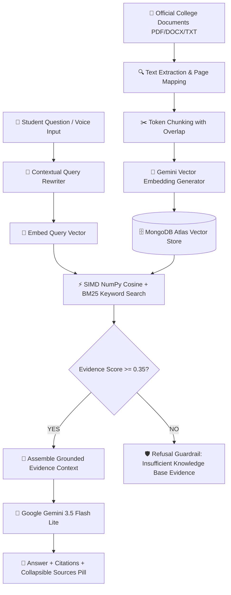

# 🏛️ College RAG Assistant — AI-Powered Campus Information Portal

> **An enterprise-grade, retrieval-augmented college assistant powered by Google Gemini, FastAPI, and MongoDB Atlas.**

---

## 📋 Table of Contents
1. [Project Name](#1-project-name)
2. [Problem Statement](#2-problem-statement)
3. [Features](#3-features)
4. [Technology Stack](#4-technology-stack)
5. [Screenshots](#5-screenshots)
6. [Live Demo](#6-live-demo)
7. [Backend](#7-backend)
8. [Setup Instructions](#8-setup-instructions)
9. [Environment Variables](#9-environment-variables)
10. [RAG Pipeline Architecture](#-rag-pipeline-architecture)
11. [REST API Reference](#-rest-api-reference)

---

## 1. Project Name
**College RAG Assistant** (Campus AI Information Portal)

---

## 2. Problem Statement
College students, parents, and prospective applicants frequently struggle to navigate hundreds of pages of disjointed official PDF handbooks, circulars, and notices across multiple campus departments (admissions, tuition fees, examination rules, hostel regulations, and academic calendars). 

Standard commercial chatbots or basic LLM wrappers often hallucinate inaccurate fee figures, outdated deadlines, or nonexistent policies. 

**Solution:** The **College RAG Assistant** employs a strict **Retrieval-Augmented Generation (RAG)** pipeline. It indexes official university documents in a high-dimensional vector database (MongoDB Atlas) and performs dense semantic vector search + lexical keyword scoring. The assistant generates 100% verified, grounded answers accompanied by exact handbook citations and page references, while strictly refusing to hallucinate when knowledge is unavailable.

---

## 3. Features

### ⭐ Core / Must-Have Features
- 💬 **Interactive Chat Interface**: Student-friendly chat with suggestion chips, capability preset cards, and dynamic loading animations.
- 🔐 **User Authentication**: JWT-based authentication with role-based access control (`student`, `faculty`, `admin`, `super-admin`).
- 📄 **Multi-Format Document Upload**: Ingestion support for `.pdf`, `.docx`, `.txt`, `.md`, and `.csv` handbooks with metadata and SHA-256 deduplication.
- ✂️ **Page-Aware Processing & Chunking**: Sentence-bounded token chunking with configurable overlap and section hierarchy extraction.
- 📐 **High-Dimensional Embeddings**: 3072-dimensional vector embeddings generated using Google Gemini (`models/gemini-embedding-001`).
- 🗄️ **Vector Database Semantic Search**: Cloud MongoDB Atlas vector storage with in-memory SIMD NumPy cosine similarity acceleration.
- 🧠 **End-to-End RAG Pipeline**: Contextual query rewriting, dense retrieval, evidence threshold evaluation, and grounded prompt assembly.
- 🛡️ **Zero-Hallucination Refusal Guardrail**: Transparently refuses out-of-domain or unsupported queries when similarity is below threshold.
- 📚 **Interactive Source Citations**: Sleek ChatGPT/Gemini-style `[ 📚 N Sources ▾ ]` collapsible drawer with document title, version, page number, snippet, and pulse-highlighting.
- 💬 **Chat History & Context Memory**: Multi-turn conversation persistence in MongoDB with contextual follow-up query rewriting.
- 👑 **Admin Management Portal**: Complete dashboard to inspect chunks, publish, unpublish, archive, re-index, and delete documents.
- ⚡ **Optimistic 0ms UI Updates**: Instant client-side feedback for creating, switching, and deleting conversations with zero network lag.

### 🚀 Bonus Features
- 📂 **Multiple Document Collections**: Organize documents by category (Admissions, Fees, Hostel, Academics, Exams).
- 🏢 **Department-Wise Knowledge Bases**: Filter queries by specific department collection IDs.
- 📊 **Admin Analytics & Audit Logs**: Real-time tracking of query volumes, unanswered query rates, retrieval latency, and administrative actions.
- 🔄 **Document Version Management**: Track version tags (`v2026-27`, `v1.0`) across revisions and display active versions in citations.
- ✨ **Interactive Source Highlighting**: Clicking inline citation badges (`[1]`, `[2]`) in chat automatically expands the sources drawer and pulse-highlights the exact excerpt.
- 💯 **Confidence & Relevance Scoring**: Real-time cosine similarity scores (`0.00` – `1.00`) and verification status badges.
- 🌐 **Multilingual Support**: Supports multi-language queries with Gemini's multilingual zero-shot grounding.
- 🎙️ **High-Accuracy Voice Input**: Hands-free Speech-to-Text with automatic pause detection and auto-send.
- 💡 **Suggested Questions**: Interactive quick-prompt chips for common campus inquiries.
- 👍 **Answer Feedback (👍 / 👎)**: Student feedback collection stored in MongoDB for quality tracking.
- 🔍 **Hybrid Keyword + Semantic Search**: Weighted combination of vector cosine similarity (70%) and BM25 keyword matching (30%).
- 🎯 **Document Re-Ranking**: Cross-scoring reranker for optimal passage prioritization.
- 🌊 **Streaming AI Responses**: Server-Sent Events (SSE) streaming endpoint `/api/chat/stream/{id}`.
- 📋 **One-Click Copy**: Instant response copying with visual confirmation.

---

## 4. Technology Stack

| Layer | Technologies & Services |
| :--- | :--- |
| **Frontend** | HTML5, Vanilla CSS3 (Custom Dark Theme, Glassmorphism, 3D Tilt), JavaScript (ES6+), Next.js |
| **Backend API** | Python 3.10+, FastAPI, Uvicorn, Pydantic v2, GZip Middleware |
| **Database & Storage** | MongoDB Atlas (Cloud Vector Store), GridFS (Binary Document Storage), PyMongo |
| **AI & Embeddings** | Google AI Studio / Gemini (`gemini-3.5-flash-lite`), Gemini Embeddings (`models/gemini-embedding-001`), NumPy |
| **Document Processing** | PyMuPDF (fitz), pdfplumber, python-docx, pypdf |
| **Security & Auth** | OAuth2 Password Bearer, JWT (JSON Web Tokens), Passlib (Bcrypt hashing) |
| **Speech & Audio** | Web Speech Recognition API (`webkitSpeechRecognition`) |
| **Deployment** | Vercel (Frontend), Render (Backend), MongoDB Atlas (Cloud Database) |

---

## 5. Screenshots

### 1. 3D Animated University Portal Login
Interactive 3D card tilt with background campus scenery carousel and instant role switching.

### 2. Verified Student Chat & Grounded Answers
Clean chat interface featuring verified evidence status badges, instant responsive messages, and quick suggestion chips.

### 3. Collapsible ChatGPT / Gemini-Style Sources Drawer
Interactive **`[ 📚 Sources ▾ ]`** pill button that expands to reveal supporting official handbooks, page numbers, and highlighted snippets.

### 4. Admin Management & Ingestion Dashboard
Full administration panel for uploading documents, inspecting token chunks, and monitoring campus query analytics.

---

## 6. Live Demo
- 🌐 **Frontend Application (Vercel)**: `https://your-college-rag-frontend.vercel.app` *(or locally at `http://localhost:8000/`)*

---

## 7. Backend
- ⚡ **Backend API URL (Render)**: `https://college-rag-backend.onrender.com`
- 📖 **Interactive Swagger Docs**: `https://college-rag-backend.onrender.com/docs` *(or locally at `http://localhost:8000/docs`)*
- 🩺 **Health Check**: `https://college-rag-backend.onrender.com/api/health`

---

## 8. Setup Instructions

### Prerequisites
- Python 3.10, 3.11, or 3.12
- MongoDB Atlas account (or local MongoDB on port 27017)
- Google AI Studio API Key (or OpenAI API key / offline mock mode)

---

### Step 1: Clone & Enter Project Directory
```bash
git clone https://github.com/YOUR_USERNAME/YOUR_REPOSITORY.git
cd "Rag AI Chatbot"
```

---

### Step 2: Create & Activate Python Virtual Environment

#### On Windows (PowerShell):
```powershell
python -m venv venv
.\venv\Scripts\Activate.ps1
```

#### On macOS / Linux:
```bash
python3 -m venv venv
source venv/bin/activate
```

---

### Step 3: Install Dependencies
```bash
pip install -r backend/requirements.txt
```

---

### Step 4: Configure Environment Variables
Copy `.env.example` to `.env`:
```bash
# On Windows PowerShell:
Copy-Item .env.example .env

# On macOS / Linux:
cp .env.example .env
```

Edit `.env` and provide your credentials:
```env
MONGODB_URI="mongodb+srv://<username>:<password>@cluster.mongodb.net/?appName=Ragcollegeai"
MONGODB_DB_NAME="college_rag"
AUTH_SECRET="your_custom_jwt_secret_key_here"

LLM_PROVIDER="gemini"
LLM_API_KEY="your_google_ai_studio_api_key"
LLM_MODEL="gemini-3.5-flash-lite"

EMBEDDING_PROVIDER="gemini"
EMBEDDING_API_KEY="your_google_ai_studio_api_key"
EMBEDDING_MODEL="models/gemini-embedding-001"
EMBEDDING_DIMENSIONS=3072
```

---

### Step 5: Seed Official College Handbooks
Populates default accounts and indexes 5 official handbooks with Gemini vectors into MongoDB Atlas:
```bash
python scripts/seed_data.py
```

Default credentials seeded:
- 🎓 **Student**: `student@college.edu` / `student123`
- 👑 **Admin**: `admin@college.edu` / `admin123`

---

### Step 6: Start the Application Server
```bash
python scripts/run_dev.py
```

Open your browser at **[http://localhost:8000/](http://localhost:8000/)**.

---

## 9. Environment Variables

The following environment variables configure the system:

| Variable Name | Required | Default | Description |
| :--- | :---: | :---: | :--- |
| `PROJECT_NAME` | No | `"College RAG Assistant"` | Name of the project displayed in UI and docs |
| `ENVIRONMENT` | No | `"development"` | `"development"` or `"production"` |
| `DEBUG` | No | `True` | Enable/disable debug logs |
| `AUTH_SECRET` | **Yes** | — | Long secret key for signing JWT tokens |
| `ACCESS_TOKEN_EXPIRE_MINUTES` | No | `10080` | JWT expiration duration in minutes (7 days) |
| `DATABASE_TYPE` | No | `"mongodb"` | Database type (`"mongodb"` or `"inmemory"`) |
| `MONGODB_URI` | **Yes** | — | MongoDB Atlas cloud connection URI |
| `MONGODB_DB_NAME` | No | `"college_rag"` | Target database name |
| `LLM_PROVIDER` | **Yes** | `"gemini"` | LLM provider (`"gemini"`, `"openai"`, `"mock"`) |
| `LLM_API_KEY` | **Yes** | — | API key for the chosen LLM provider |
| `LLM_MODEL` | No | `"gemini-3.5-flash-lite"` | Active LLM model name |
| `EMBEDDING_PROVIDER` | **Yes** | `"gemini"` | Embedding provider (`"gemini"`, `"openai"`, `"mock"`) |
| `EMBEDDING_API_KEY` | **Yes** | — | API key for generating vector embeddings |
| `EMBEDDING_MODEL` | No | `"models/gemini-embedding-001"` | Vector model name |
| `EMBEDDING_DIMENSIONS` | No | `3072` | Embedding vector dimensions (3072 for Gemini) |
| `RAG_TOP_K` | No | `20` | Candidate vector chunks retrieved |
| `RAG_CONTEXT_K` | No | `5` | Maximum passages included in LLM context |
| `RAG_SIMILARITY_THRESHOLD` | No | `0.35` | Minimum cosine similarity to accept evidence |
| `HYBRID_SEARCH_ENABLED` | No | `True` | Enable hybrid vector + BM25 keyword scoring |

> ⚠️ **Security Notice**: Never commit actual API keys, database passwords, or JWT secrets to GitHub. Always use `.env` (ignored by `.gitignore`).

---

## 🔄 RAG Pipeline Architecture



---

## 🔌 REST API Reference

| Method | Endpoint | Access | Description |
| :--- | :--- | :---: | :--- |
| `POST` | `/api/auth/register` | Public | Register new student or faculty account |
| `POST` | `/api/auth/login` | Public | Authenticate user and receive JWT bearer token |
| `GET` | `/api/auth/me` | Authenticated | Retrieve current user profile |
| `POST` | `/api/chat/conversations` | Authenticated | Create a new conversation session |
| `GET` | `/api/chat/conversations` | Authenticated | List user conversation history |
| `GET` | `/api/chat/conversations/{id}` | Authenticated | Retrieve message history for a conversation |
| `DELETE` | `/api/chat/conversations/{id}` | Authenticated | Delete a conversation |
| `POST` | `/api/chat/conversations/{id}/messages` | Authenticated | Ask question & trigger full RAG pipeline |
| `POST` | `/api/chat/messages/{id}/feedback` | Authenticated | Submit thumbs up/down feedback |
| `GET` | `/api/admin/collections` | Admin | List all knowledge collections |
| `POST` | `/api/admin/documents` | Admin | Upload and start automated document ingestion |
| `POST` | `/api/admin/documents/{id}/publish` | Admin | Publish document to live knowledge base |
| `GET` | `/api/admin/analytics/overview` | Admin | Retrieve system query analytics & audit logs |
| `GET` | `/api/health` | Public | System health check |
